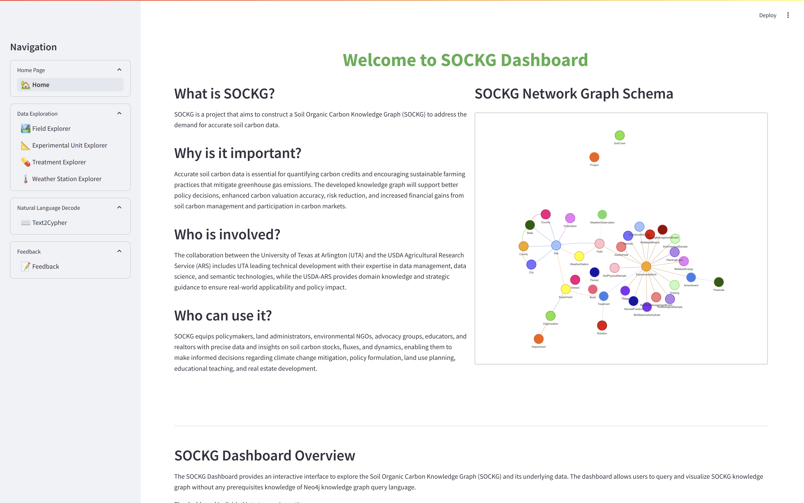

# SOCKG Dashboard

The SOCKG Dashboard is an interactive web application built for the Soil Organic Carbon Knowledge Graph (SOCKG). It provides an intuitive layer above the knowledge graph, enabling users to explore SOCKG through predefined pages without needing to write query language. These pages are designed to cover most of the knowledge graph, allowing users to interact with SOCKG’s data easily. However, for advanced use cases that require aggregation across multiple pages, direct access to the SPARQL endpoint or Neo4j browser is recommended. 

## Table of Contents

- [Features](#features)
- [Prerequisites](#prerequisites)
- [Installation](#installation)
- [Usage](#usage)
- [Directory Structure](#directory-structure)
- [Key Components](#key-components)
- [License](#license)

## Features

- **Data exploration pages**: These pre-defined pages allow users to explore specific aspects of the knowledge graph that are of particular importance. They include:
  - ***Field Exploration***: This page allows users to select one of many available fields in SOCKG, each representing a section of land with multiple experimental units. Users can view useful information about each field, such as precipitation levels and associated research publications.
  - ***Experimental Unit Exploration***:At the core of SOCKG, data is measured at the experimental unit level. This exploration page enables users to examine individual experimental units and the data collected on them, filtering them by criteria like geographical location (state, county, site, and field). When a unit is selected, its exact location is displayed (when available), along with relevant data. Users can also plot the data on a 2D graph with customizable axes.
  - ***Treatment Exploration***: This page helps users explore treatments that influence agricultural outcomes and soil health. Filters allow users to refine their search by factors like crop type and fertilizer type (organic, synthetic, etc.). Once a treatment is selected, all experimental units associated with that treatment are displayed, user can also jump from the treatment page to experimental unit page by clicking.
  - ***Weather Station Exploration***: This page provides access to weather data collected by multiple weather stations throughout the year. Once a weather station is selected, its data is displayed in a table, and users can optionally plot data on a 2D graph with chosen x and y axes.
- **Ontology Exploration**: This page offers users a visual overview of the SOCKG structure as a knowledge graph (how classes are interconnected with each other). Users can click on any node (class) to view the total number of instances in that class (e.g., 3,809 experimental units). Each class has its own data attributes (akin to table columns in SQL). By double-clicking a class, users can see its attributes, and by clicking an attribute, they can view sample values and data types.
- **Natural Language Querying**: Query the Neo4j knowledge graph using natural language.

## Prerequisites
To run the dashboard locally, ensure the following requirements are met:
- Docker installed on your system (version 27.1.1 is tested)
- Since this project make use llama3:7b. 16GB of memory and a GPU available machine is recommmend

## Installation

This application is built and tested on Python 3.8. All dependencies are managed through Docker and a Python requirements.txt file.

To set up and run the application:

1. Clone the repository:
```
$ https://github.com/idirlab/sockg.git
```
2. Go into sockg-dashboard directory
```
$ cd sockg/sockg-dashboard/
```

3. Configure API key and Neo4j credentials:
- Navigate to `streamlit_app/.streamlit/`
- Create a file named `secrets.toml`
- Add the following configurations to `secrets.toml`:
```
  API_KEY = "<your gemini api key>"
  MODEL = "<llm model>"

  NEO4J_URI = "bolt://idir.uta.edu:7687"
  NEO4J_USERNAME = "<your sockg username>"    # Contact IDIR lab
  NEO4J_PASSWORD = "<your sockg password>"    # Contact IDIR lab
  MAP_BOX_API = <Your mapbox api key>         # Obtain for free on mapbox.com
```

4. Build and start the Docker containers:
```
docker compose up
```
This command builds the necessary Docker images and starts the containers as defined in the `docker-compose.yml` file.

## Usage

If built locally, After the Docker build process completes and containers are running:

1. Open your web browser and go to `http://localhost:8501`
2. You will see the SOCKG Dashboard web interface.

Note: The application runs on port 8501 by default. Ensure this port is not in use by other applications on your system. Below is the example run of the app.

The dashboard is also available online at `https://sockgdashboard.streamlit.app/`


## Directory Structure
The project is organized as follows (assume sockg-dashboard is root):
```
/sockg-dashboard
├── streamlit_app/        # Source code for the application
│   ├── .streamlit        # Configuration directory (e.g., secrets.toml)
│   ├── collected_datas/  # User ratings for question-cypher pairs
│   │   └── ....json
│   ├── components/       # Reusable visualization components
│   |   └── ...
|   ├── models/           # LangChain objects for LLMs and embeddings
|   ├── neo4j-connector   # Neo4j driver initialization
|   ├── pages/            # Streamlit pages (e.g., /Fields, /Treatment)
|   ├── templates/        # LLM prompt templates
|   └── tools/            # LangChain tools for few-shot (RAG) agents
|
├── Docker-compose.yaml   # Docker Compose specification
└── README.md             # Project overview
```
